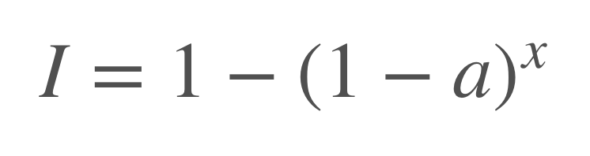

# CUDA Implementation and Rendering of Schrodinger’s Smoke
by Yixiu Zhao (yixiuz) and Shangda Li (shangdal)

## Demo and Final Report
[Link to a video of our algorithm simulating and rendering Schrodinger’s Smoke with 5,000,000 particles in real-time at 48 FPS.](https://www.youtube.com/watch?v=gY28SRlS48I)

[Link to our Final Report](Final report.pdf) 

## Summary
We present our CUDA parallel implementation of a novel fluid simulation algorithm known as Incompressible Schrodinger Flow as well as a particle density map renderer that outputs high resolution images in real time.

## Background

The paper “Schrodinger’s Smoke” (Chern et al.) describes a new approach for the purely Eulerian simulation of incompressible fluids. In it, the fluid state is represented by a  valued wave function evolving under the Schrödinger equation subject to incompressibility constraints. By solving the time evolution of Schrodinger’s equation, sometimes along with other constraints (like constant velocity constraint in case of simulating a jet), we obtain all the information of the evolution of the fluid. From the complex wave functions, the velocity field of the flow is computed. This is the Incompressible Schrodinger Flow (ISF) algorithm. This algorithm is not only elegant, but produces great results, as the comparison with real life smoke the original paper showed (Fig.1).

With the velocity field, we can visualize the fluid flow with particle advection. Particle advection is the technique for visualizing a vector field by having virtual particles follow the field vectors. To make relatively accurate trajectories in the discrete-time setting, the Fourth-order Runge-Kutta method is used, as is common in approximation problems like these. These advected particles can then be rendered each as transparent white dots with a constant alpha value. To sum up, there are three distinctive components to the whole algorithm: the ISF simulation itself, particle advection, and rendering (Fig. 2). The advantage of this approach is that it is a purely grid-based, Eulerian fluid simulator. We don't need to track the dynamics of the individual particles one by one, but we can still keep these fine, small-scale details in a way that rivals Lagrangian simulations, but without the huge additional costs.

The key data structures are three dimensional grids of numerical data of type double and cuDoubleComplex, where cuDoubleComplex is the CUDA implementation of complex numbers. Three main types of key operations are performed on the data in this algorithm. These operations are element-wise product, forward and inverse Fourier Transforms, and differentiation. Note that differentiation in the discrete grid setting is just taking the difference of value between adjacent grid points.

The ISF component of the algorithm takes in the size of the grid as well as initial state of the wave function and outputs the state of the wave function after a certain number of iterations. To simulate fluids under more complex constraints, additional parameters might be added to the simulation (like jet size and velocity in the case of a jet). The advection component takes in an array of particles with their three-dimensional positions, and outputs the new positions after a small amount of time. Finally, the rendering component takes in the positions of the particle, along with an output image size, and outputs an image based on the XY projections of the particles.

The ratio of computation time of the three components vary with key parameters like the resolution of the fluid grid solver and the number of particles. The computational cost of ISF increase with the number of voxels, while both particle advection and rendering time increase unsurprisingly with the number of particles. All three components are considerably parallel, while ISF is less parallel because of its multitude of computation steps which can each be done in a highly parallel way but depend on the results of the operations that come before it. ISF is also highly regular and localized in its array access patterns, unlike particle advection, which accesses the velocity array based on each particle’s position. Finally, the renderer is also highly parallel, similar to the circle renderer from assignment 2. However, there are a couple of differences. First, since the particles are points instead of circles, each particle only affects the color of one pixel (although it is an arbitrary design decision we can play around with), which reduces the complexity of the problem. On the other hand, the number of particles is typically several orders of magnitude higher than the number of circles (starting at 500k), which renders (excuse the pun) our original algorithm in the assignment intractable, since it had to allocate too much memory to keep track of the containment relationships between the particles and each pixel block. Last but not least, the nature of the problem demands consecutive rendering of images, preferably in real time, which means the initialization time of the renderer in between each frame should also be taken into consideration.

## Approaches and results
We start with the MATLAB code and Houdini scripts published by the original authors and rewrite the algorithm on the GPU platform using C++ and CUDA. In the implementation of the rendering part, we also use the Thrust library and the rendering framework from assignment 2. Note that we are only using the part of code that was given to us, and not reusing any of the kernels we wrote for the assignment. The core rendering algorithm is not included in the original paper and is entirely original.

### Part I. The main ISF algorithm
The main ISF algorithm is relatively easy to parallelize, as most computational steps are element wise, and we only need to map all the positions in the grid to the threads. We time all the steps of the computation and create a chart to identify the most time-consuming parts (Figure 3. left). Apart from the calls to Fourier Transforms in the cuFFT library, we can see that the functions VelocityOneForm_kernel (V1F) and PoissonSolveMain_kernel (Poisson) are most time consuming. Since VelocityOneForm_kernel also accesses adjacent elements of the current position, we assume that the reason for the high cost is memory related (which is a wrong assumption, as we will see later).

We make multiple attempts to parallelize the function using tricks learned on the CUDA website in the hope that the program can be more efficient in accessing global memory. The simple tricks like grid stride loops, and using the __restrict__ keyword yield no meaningful results, so we move on to more a more sophisticated method, which is using shared memory as a cache for memory access. Still, there is no improvement at all.

After all these fails, we realize that at the grid resolution of 128 * 64 * 64, the ISF component is compute bound, because trigonometric functions are very high in arithmetic intensity. Deleting all computations of trigonometric function in the VelocityOneForm_kernel decreased its run time by about 90%. There is a possibility that at higher grid resolutions the memory effects will become more apparent, however we observe that the cost of FFT dominates at higher grid resolutions. Therefore, we decide that optimizing for memory access and cache locality will not yield meaningful results.

Looking at the function PoissonSolveMain_kernel, we discover that it is just an element-wise product of a coefficient matrix and the divergence matrix. The construction of the coefficient matrix is highly complex, but its values do not change. Since we know the code is compute bound, we can save the values coefficient matrix for later use. This almost entirely eliminated the cost of the function and thus improved the runtime of ISF by 10% at our baseline resolution of 128 * 64 * 64 (Figure 3. right).

### Part II. Particle Advection

In this section we look at the relationship between the total cost of ISF and particle advection (not including rendering) and its relationship with the number of particles. As we can see in Figure 4, the cost of particle advection is roughly linearly proportional to the number of particles. At the order of magnitude of 10000000, the cost is entirely dominated by particle advection. Similar to ISF, particle advection is also compute bound, and the most costly operation in this part is the three-dimensional interpolation of velocity vectors. Using the Fused Multiply-Add (FMA) operation provided by CUDA, we are able to yield a small amount (about 7%) of speedup for particle advection (see Figure 5. below).

After this optimization, we decide to move on to the rendering part. There are two reasons for not focusing on particle advection. Firstly, since the adjacent particles stored in memory is not necessarily adjacent in grid space, array access is inherently random, which makes it hard to do further non-trivial optimizations. Secondly, because of the same reason, rendering is really hard, and the naive implementation of the rendering algorithm takes significantly more time that the advection itself. We therefore move on to the rendering part.

### Part III. Rendering
Since we are not familiar with the advanced techniques for rendering fluid or smoke, for this project we decide to keep things simple: we will render the image from the z axis, shading each pixel according to the number of particles whose projections are within that pixel. If we treat each particle as a transparent dot with alpha channel a and unit intensity, then if a pixel contains x particles, the final intensity of that pixel can be computed as:

In the naive implementation, we simply run a parallel thread for each pixel in the image, then the thread loops over all particles and check if each particle’s projection is within that pixel. After getting the number of pixels, the thread shades that pixel accordingly. This is incredibly slow when the number of particles is large, so we designed another algorithm to keep track of the number of particles within each pixel. In our efficient algorithm, we instead have each particle check which pixel its projection is in when its position is updated each time. The pixels are presented as integer indices and this information is stored in an array. We then sort the array of particle indices according to pixel index with the parallel sort function provided by the Thrust library. After sorting the array, we have all the indices of the particles paired with the indices of pixels, and we basically implement a parallel collect algorithm to count the number of particles in each pixel. First we find the breakpoints in the array. Then we use Thrust::copy_if to only copy the cumulative particle count of the breakpoints into a new array. In the end we take the difference between the adjacent cumulative counts to get the count of particles within each pixel, paired with the index of that pixel. The complete algorithm is demonstrated in (Figure 6.).

We run experiments with different amounts of particles and record the rendering time taken for both the naive and the efficient methods. The results are shown above in Figure 7 and Figure 8.  We can see that the efficient method, due to its parallel nature using scan, is significantly faster than the naive method. In fact, when simulating 5000 particles, the efficient method is 800 times faster than the efficient method, in terms of the rendering time per frame. Moreover, the efficient method scales well with increasing number of particles, as it fundamentally consists of three generically paralleled algorithms: sort, map and scan.

This efficient rendering method is critical to the whole algorithm, because it enables real-time simulation and rendering at 48 FPS (frames per second) with 5,000,000 particles.

## Summary
Incompressible Schrodinger’s Flow is a novel algorithm that is elegant, efficient and realistic. In our CUDA implementation, we are able to achieve a 750x speedup over the original MATLAB implementation, both run on the GHC machines. We are unable to produce further speedup due to the fact that the algorithm is sequential in its framework, and that its arithmetic intensity is high. 

We do however, make up for this fact by designing and implementing an efficient parallel renderer which can render 5 million particles at 48 frames a second. Since at very large particle counts, the dominant factor in time consumption is rendering, our efficient rendering algorithm is the deciding factor that makes real time rendering in practical applications possible.

